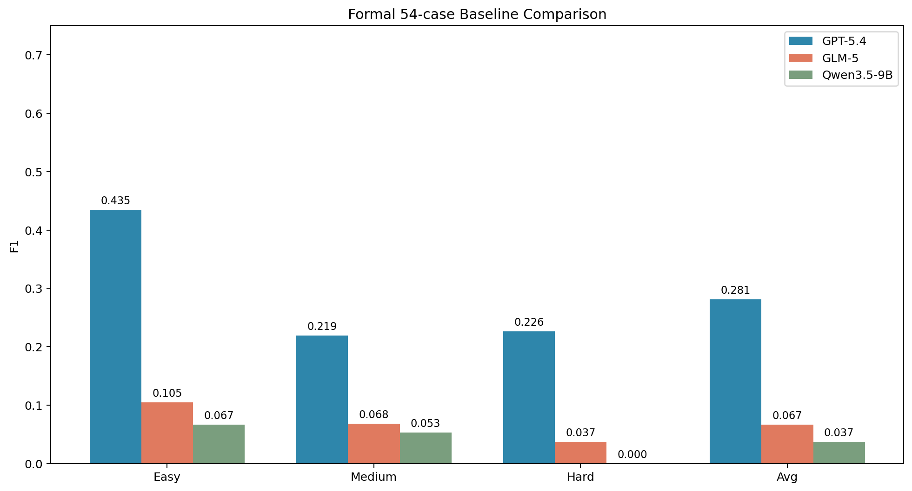
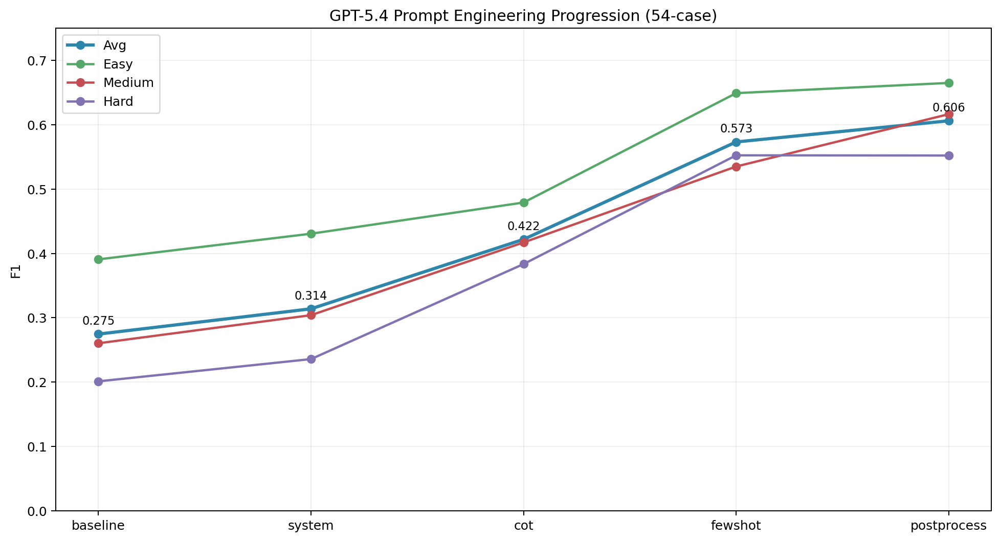
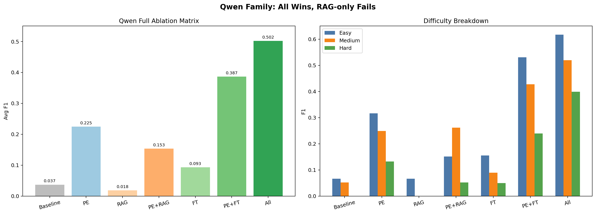

# Celery 跨文件依赖分析：基于 PE / RAG / FT 的效果优化

面向腾讯实习考核题的正式仓库版本。任务聚焦于：

- 真实开源项目上的跨文件依赖分析
- 评测集构建与瓶颈诊断
- Prompt Engineering 系统优化
- RAG 增强检索与上下文融合
- Qwen 领域微调与消融实验

## 核心发现

1. **PE 是当前最强单项增益**  
   在正式 `54-case` 口径上，GPT-5.4 从 `baseline 0.2745` 提升到 `postprocess 0.6062`，绝对提升 `+0.3317`，相对提升 `+120.8%`。

2. **strict 加固后的 GPT PE 最优路线已经更新为 `targeted few-shot + postprocess`**  
   在 `2026-03-29` 的 strict PE 搜索增补里，`postprocess_targeted` 达到 `union 0.6338 / macro 0.4757 / mislayer 0.1620`，同时优于此前 strict-best 的 `0.6136 / 0.4372 / 0.2336`。详见 [`reports/strict_pe_search_20260329.md`](reports/strict_pe_search_20260329.md)。

3. **Qwen 的完整消融矩阵已经补齐，最佳开源组合是 `PE + RAG + FT`**  
   Qwen strict baseline 仅 `0.0370`，`PE only` 到 `0.2246`，`FT only` 到 `0.0932`，`PE + FT` 到 `0.4315`，最终 `PE + RAG + FT` 到 `0.4435`。这说明 PE 是开源模型的核心增益源，FT 负责领域适配，RAG 只有在和 PE/FT 组合时才真正有价值。

4. **RAG 的价值是“定向修复 hard 场景”，不是无脑全局提分**  
   GPT-5.4 端到端 `No-RAG 0.2783 -> With-RAG 0.2940`，总体只提升 `+0.0157`；但 `Hard` 难度从 `0.1980 -> 0.3372`，提升 `+0.1392`。RAG 更像是针对 Type A / Type E 的补偿模块。

## 当前结果总览

| 策略 / 模型 | Easy | Medium | Hard | Avg | 说明 |
|------|------:|------:|------:|------:|------|
| GPT-5.4 Baseline | 0.4348 | 0.2188 | 0.2261 | 0.2815 | 商业模型基线 |
| GLM-5 Baseline | 0.1048 | 0.0681 | 0.0367 | 0.0666 | 官方 API，保留原始 thinking |
| Qwen3.5-9B Baseline | 0.0667 | 0.0526 | 0.0000 | 0.0370 | 严格恢复版，45/54 parse fail |
| GPT-5.4 PE only | 0.6651 | 0.6165 | 0.5522 | 0.6062 | 54-case 正式重跑 |
| GPT-5.4 RAG only | 0.2722 | 0.2656 | 0.3372 | 0.2940 | 端到端 weighted RAG |
| Qwen PE only | 0.3167 | 0.2491 | 0.1323 | 0.2246 | 正式 54-case |
| Qwen RAG only | 0.0667 | 0.0000 | 0.0000 | 0.0185 | 最新 Google embedding |
| Qwen PE + RAG | 0.1514 | 0.2614 | 0.0523 | 0.1534 | 最新 Google embedding |
| Qwen FT only | 0.1556 | 0.0895 | 0.0500 | 0.0932 | LoRA 后正式结果 |
| Qwen PE + FT | 0.5233 | 0.5370 | 0.2624 | 0.4315 | 开源模型高性价比路线 |
| Qwen PE + RAG + FT | 0.4985 | 0.4805 | 0.3672 | 0.4435 | 最新 Google embedding，当前开源最优 |

## 正式评分口径

- 主评分指标：将 `direct_deps / indirect_deps / implicit_deps` 三层并集后做 FQN 精确匹配。
- 三层标签仍完整保留在正式数据里，用于瓶颈诊断、few-shot 构造和 bad case 展示。
- 严格复验时，补充看 `active-layer macro F1` 和 `mislayer rate`，见 [`reports/strict_scoring_audit_20260329.md`](reports/strict_scoring_audit_20260329.md)。
- 正式资产边界与历史归档清单见：[`docs/official_asset_manifest.md`](docs/official_asset_manifest.md)

## Strict 复验入口

- strict 数据审计：[`reports/strict_data_audit_20260329.md`](reports/strict_data_audit_20260329.md)
- strict 评分审计：[`reports/strict_scoring_audit_20260329.md`](reports/strict_scoring_audit_20260329.md)
- strict PE 搜索增补：[`reports/strict_pe_search_20260329.md`](reports/strict_pe_search_20260329.md)
- 答辩主讲稿：[`reports/defense_script_20260329.md`](reports/defense_script_20260329.md)
- 导师追问 Q&A：[`reports/defense_qa_20260329.md`](reports/defense_qa_20260329.md)
- 导师一页式摘要：[`reports/executive_summary_20260329.md`](reports/executive_summary_20260329.md)
- 答辩页提纲：[`reports/defense_slides_outline_20260329.md`](reports/defense_slides_outline_20260329.md)
- 提交前检查清单：[`reports/final_submission_checklist_20260329.md`](reports/final_submission_checklist_20260329.md)
- 数字速查表：[`reports/final_numbers_cheatsheet_20260329.md`](reports/final_numbers_cheatsheet_20260329.md)
- strict 数据资产：
  - `data/fewshot_examples_20_strict.json`
  - `data/finetune_dataset_500_strict.jsonl`
- strict 常用命令：

```bash
make audit-strict
make rescore-strict

FEWSHOT_DATA_PATH=data/fewshot_examples_20_strict.json \
python3 scripts/run_pe_eval.py \
  --api-key "<api-key>" \
  --variants fewshot,postprocess \
  --output-dir results/pe_eval_strict_replay

make train-strict
```

## 图表速览







## 当前完成度

### 已完成

- 正式评测集：[`data/eval_cases.json`](data/eval_cases.json)，`54` 条，全部手工标注
- 正式 few-shot 库：[`data/fewshot_examples_20.json`](data/fewshot_examples_20.json)，`20` 条
- 正式微调集：[`data/finetune_dataset_500.jsonl`](data/finetune_dataset_500.jsonl)，`500` 条
- GPT / GLM / Qwen baseline
- GPT PE 四阶段正式重跑
- Google embedding 版本 RAG 检索正式评测
- GPT 端到端 RAG 正式评测
- Qwen `PE / RAG / PE+RAG / FT / PE+FT / PE+RAG+FT` 全矩阵
- 最终图表与正式报告

### 如需复现 Qwen 完整矩阵

- 现在没有必须补跑项。
- 如果你想在同一环境重现这 4 组正式结果，仍然可以直接使用统一入口：
  - `Qwen PE only`
  - `Qwen RAG only`
  - `Qwen PE + RAG`
  - `Qwen PE + RAG + FT`

复现命令见：

- [`docs/qwen_remaining_runs_20260328.md`](docs/qwen_remaining_runs_20260328.md)

## Google embedding 说明

### 现在需不需要重跑 embedding

- **当前这台机器上不需要。**
- 最新 Google embedding cache 已经完整生成：
  - `artifacts/rag/embeddings_cache_google_gemini_embedding_001_3072.json`

### 直接 `git pull` 能不能拿到这个缓存

- **不能。**
- `artifacts/` 没有进 git，这个缓存文件约 `326MB`，因此不会跟随仓库自动分发。

### 实际影响

- 如果你还在这台机器上继续跑 Qwen 的 RAG 相关实验，可以直接复用，不需要重新切片。
- 如果你换到另一台机器重新拉仓库，拿到的是代码、结果 JSON、报告和完整的重建脚本，不会自动拿到这个 embedding cache。
- 跨机器复现有两条路：
  - 手动复制这份 cache，直接复用。
  - 运行 `scripts/precompute_embeddings.py` 在新机器上重新生成 cache。
- 因此正式 RAG 方案是**可复现的**，只是大体积 cache 没有直接进 git。

## Quick Start

### 0. 安装依赖

```bash
pip install -r requirements.txt
```

如果你要跑 LoRA / QLoRA 训练，再额外安装：

```bash
pip install -r requirements-finetune.txt
```

### 1. 数据检查

```bash
export PYTHONPATH=.
make lint-data
make audit-strict
```

### 2. 基线与 RAG 检索

```bash
make eval-baseline
export EMBEDDING_PROVIDER=google
export GOOGLE_API_KEY=你的_google_key
make eval-rag
```

`make eval-rag` 使用正式的 Google embedding 口径，运行前需要先设置 `EMBEDDING_PROVIDER=google` 和 `GOOGLE_API_KEY`。

### 3. 生成最终图表与指标快照

```bash
make report
```

### 4. Qwen 完整消融复现

```bash
uv run --with openai python run_qwen_ablation_eval.py --mode pe

export EMBEDDING_PROVIDER=google
export GOOGLE_API_KEY=你的_google_key
uv run --with openai python run_qwen_ablation_eval.py --mode rag --repo-root external/celery
uv run --with openai python run_qwen_ablation_eval.py --mode pe_rag --repo-root external/celery
```

## 仓库结构

交付视角下，这个仓库可以理解为：

```text
celery-dep-analysis/
├── README.md                          # 项目总览、核心结论、复现入口
├── Makefile                           # 一键复现入口
├── requirements.txt                   # Python 依赖
├── Dockerfile                         # 统一复现环境
│
├── data/                              # 正式数据资产
│   ├── eval_cases.json                # 54 条正式评测集
│   ├── finetune_dataset_500.jsonl     # 500 条正式微调数据
│   └── fewshot_examples_20.json       # 20 条正式 few-shot 示例
│
├── evaluation/                        # 模型评测与指标计算
│   ├── baseline.py                    # 数据摘要 / Prompt 预览 / RAG 检索评测入口
│   ├── metrics.py                     # F1 / Recall@K / MRR 等指标计算
│   ├── run_gpt_eval.py                # GPT-5.4 基线评测
│   ├── run_glm_eval.py                # GLM-5 基线评测
│   ├── run_gpt_rag_eval.py            # GPT-5.4 端到端 RAG 评测
│   └── run_qwen_eval.py               # Qwen 基线评测
│
├── pe/                                # Prompt Engineering 方案
│   ├── prompt_templates_v2.py         # System Prompt + CoT + Few-shot 模板
│   ├── prompt_templates.py            # 旧版提示词模板
│   └── post_processor.py              # 输出解析、过滤、排序与去重
│
├── rag/                               # RAG Pipeline
│   ├── ast_chunker.py                 # AST 级代码切片
│   ├── embedding_provider.py          # Embedding Provider 抽象层
│   └── rrf_retriever.py               # 三路检索 + RRF 融合
│
├── finetune/                          # 微调与数据校验
│   ├── train_lora.py                  # LoRA 训练脚本
│   └── data_guard.py                  # 数据质量校验流水线
│
├── configs/                           # 正式训练配置
│   ├── lora_9b.toml                   # LoRA 基础配置
│   ├── qlora_9b.toml                  # QLoRA 配置
│   └── train_config_20260327_143745.yaml # 实际训练使用配置
│
├── experiments/                       # 实验组织层
│   └── README.md                      # 实验矩阵与后续 Notebook 说明
│
├── scripts/                           # 数据、图表、结果整理脚本
│   ├── generate_final_delivery_assets.py  # 生成最终图表与指标快照
│   ├── generate_project_progress_report.py # 生成项目进度报告
│   ├── recover_qwen_baseline.py           # 恢复 Qwen strict baseline
│   └── precompute_embeddings.py           # 预计算 embedding 缓存
│
├── results/                           # 所有原始结果 JSON
│   ├── gpt5_eval_results.json
│   ├── glm_eval_scored_20260328.json
│   ├── qwen_baseline_recovered_summary_20260328.json
│   ├── qwen_pe_only_20260328_stats.json
│   ├── qwen_rag_only_google_20260328_stats.json
│   ├── qwen_pe_rag_google_20260328_stats.json
│   ├── qwen_ft_20260327_160136_stats.json
│   ├── qwen_pe_ft_20260327_162308_stats.json
│   └── qwen_pe_rag_ft_google_20260328_stats.json
│
├── reports/                           # 正式报告文档
│   ├── DELIVERY_REPORT.md             # 总交付报告
│   ├── bottleneck_diagnosis.md        # 瓶颈诊断报告
│   ├── pe_optimization.md             # PE 优化报告
│   ├── rag_pipeline.md                # RAG 技术报告
│   ├── ablation_study.md              # 完整消融实验报告
│   └── project_progress_20260328.md   # 项目进度快照
│
├── docs/                              # 操作说明与结构文档
│   ├── repository_map_20260328.md     # 仓库地图与正式文件索引
│   ├── qwen_remaining_runs_20260328.md # Qwen 实验复现说明
│   ├── official_asset_manifest.md      # 正式资产清单与口径说明
│   └── SERVER_DATA_GUIDE.md           # 服务器 / 数据使用说明
│
└── img/final_delivery/                # 正式图表输出
    ├── 01_model_baselines_20260328.png
    ├── 02_pe_progression_20260328.png
    ├── 03_bottleneck_heatmap_20260328.png
    ├── 04_rag_retrieval_20260328.png
    ├── 05_rag_end_to_end_20260328.png
    ├── 06_qwen_strategies_20260328.png
    └── 07_training_curve_20260328.png
```

说明：

- 仓库当前实际目录名是 `tengxun/`
- 对外汇报或交付时，可以把项目名称写成 `celery-dep-analysis`
- 真实正式文件地图见 [`docs/repository_map_20260328.md`](docs/repository_map_20260328.md)

## 权威文档入口

- 总交付报告：[`reports/DELIVERY_REPORT.md`](reports/DELIVERY_REPORT.md)
- 瓶颈诊断：[`reports/bottleneck_diagnosis.md`](reports/bottleneck_diagnosis.md)
- PE 优化：[`reports/pe_optimization.md`](reports/pe_optimization.md)
- RAG 方案：[`reports/rag_pipeline.md`](reports/rag_pipeline.md)
- 消融矩阵：[`reports/ablation_study.md`](reports/ablation_study.md)
- 当前进度：[`reports/project_progress_20260328.md`](reports/project_progress_20260328.md)
- strict 复验说明：[`reports/strict_replay_guide_20260329.md`](reports/strict_replay_guide_20260329.md)
- Qwen 复现实验说明：[`docs/qwen_remaining_runs_20260328.md`](docs/qwen_remaining_runs_20260328.md)
- 正式资产清单：[`docs/official_asset_manifest.md`](docs/official_asset_manifest.md)

## 当前最稳的对外结论

- 如果只看商业模型上界，`GPT-5.4` 仍明显领先。
- 如果只看“可训练开源模型”的最高正式结果，当前最优是 `Qwen PE + RAG + FT = 0.4435`。
- 如果考虑工程复杂度与性价比，`Qwen PE + FT = 0.4315` 仍然是很强的默认路线。
