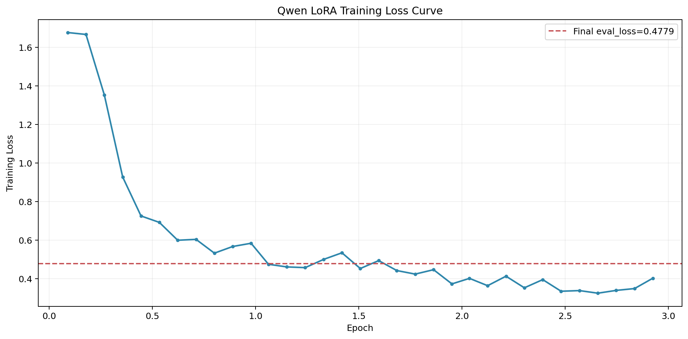

# 腾讯考核题最终交付报告

项目：**基于微调 / PE / RAG 的代码分析领域效果优化**  
方向：**Celery 跨文件依赖分析 / 动态符号解析 / 再导出链追踪**  
代码基线：`external/celery @ b8f85213f45c937670a6a6806ce55326a0eb537f`

## 1. 项目结论

### 1.1 三条最重要的结论

1. **Prompt Engineering 是当前最强单项优化**  
   在正式 `54-case` 口径上，GPT-5.4 从 `0.2745` 提升到 `0.6062`，绝对增益 `+0.3317`，相对增益 `+120.8%`。在 `2026-03-29` 的 strict PE 搜索增补里，最优路线进一步更新为 `postprocess_targeted`，达到 `union 0.6338 / macro 0.4757 / mislayer 0.1620`。这说明对于高质量商业模型，真正有效的不是更“狠”的规则，而是更针对 failure mode 的 few-shot 选例与分层保留后处理。

2. **Qwen strict-clean 训练已完成，当前最强的完整开源路线更新为 `PE + RAG + FT = 0.5018`**  
   Qwen strict baseline 只有 `0.0370`，strict-clean `FT only` 仍只有 `0.0932`，而 strict-clean `PE + RAG + FT` 达到 `0.5018`。这说明 LoRA 微调更多是在补“领域模式”，真正把模式转成稳定可评分输出的仍是 Prompt Engineering 与检索协同；需要额外说明的是，`PE + FT strict replay` 当前只有 `48/54`，因此完整 `54-case` 的 `PE + FT` 仍以历史正式 `0.4315` 作为参考。

3. **RAG 更适合解决 hard / dynamic 场景，而不是追求整体平均分**  
   GPT-5.4 端到端 `No-RAG 0.2783 -> With-RAG 0.2940`，总体只提升 `+0.0157`；但 `Hard` 难度从 `0.1980 -> 0.3372`，提升 `+0.1392`。所以 RAG 的角色是“定向修复长链路和动态解析”，不是默认全量启用的通用加分器。

## 2. 任务映射与完成度

| 题目要求 | 当前状态 | 对应产物 |
|------|------|------|
| 真实项目上构建 ≥50 条评测用例 | 完成 | `data/eval_cases.json`，54 条 |
| 识别低分场景共性瓶颈 | 完成 | `reports/bottleneck_diagnosis.md` |
| PE 四维优化与量化 | 完成 | `reports/pe_optimization.md` |
| 构建代码分析 RAG Pipeline | 完成 | `reports/rag_pipeline.md` |
| 微调数据集 ≥500 条 | 完成 | `data/finetune_dataset_500.jsonl` |
| LoRA 微调与效果评估 | 完成 | `results/qwen_ft_*`、`results/qwen_pe_ft_*` |
| 完整消融矩阵 | 完成 | `reports/ablation_study.md` |
| strict-clean FT replay 与结果审计 | 完成 | `scripts/run_qwen_strict_full.sh`、`reports/qwen_strict_closeout_20260329.md`、`reports/qwen_strict_result_audit_20260329.md` |

## 3. 数据集与评测设计

### 3.1 数据集

| 数据 | 规模 | 当前状态 |
|------|------|------|
| 正式评测集 | `54` 条 | 完成，全部手工标注 |
| Few-shot 示例库 | `20` 条 | 完成 |
| 微调数据集 | `500` 条 | 完成 |

### 3.2 评测集分布

| 维度 | 分布 |
|------|------|
| Difficulty | `easy 15 / medium 19 / hard 20` |
| Failure Type | `Type A 7 / Type B 9 / Type C 11 / Type D 11 / Type E 16` |

### 3.3 Ground Truth 口径

- 主评分指标采用三层并集后的 FQN 精确匹配
- 正式 schema 保留 `direct_deps / indirect_deps / implicit_deps` 三层，用于标注、分析与展示
- 正式 `54-case` 的 difficulty / failure_type / ground_truth 全部按源码阅读手工标注
- 微调数据由 `finetune/data_guard.py` 对 Celery 内部 FQN 做源码存在性校验，对白名单外部依赖包做显式放行

## 4. 基线模型表现

| 模型 | Easy | Medium | Hard | Avg | 备注 |
|------|------:|------:|------:|------:|------|
| GPT-5.4 | 0.4348 | 0.2188 | 0.2261 | 0.2815 | 商业模型上界 |
| GLM-5 | 0.1048 | 0.0681 | 0.0367 | 0.0666 | 原始 thinking 已保留 |
| Qwen3.5-9B | 0.0667 | 0.0526 | 0.0000 | 0.0370 | strict baseline recovered |


### 4.1 结论

- GPT-5.4 是当前明显的商业模型上界。
- GLM-5 在本任务上更常输出自然语言描述而不是结构化 FQN JSON，导致评分工具难以稳定解析；`0.0666` 更反映输出格式适配问题，而不是模型代码理解能力的绝对上界。
- Qwen 原始 baseline 的主要问题是解析失败和输出不稳定，因此 strict baseline 很低。

### 4.2 评测口径说明

GPT-5.4 与 GLM-5 使用完全相同的 baseline prompt：

- 单条 `user` 消息
- 相同的 `build_prompt_v2` 问题组织方式
- 相同的 `Return only a JSON object` 输出要求

因此这两个商业模型之间的对比是严格公平的。

Qwen3.5-9B baseline 额外加入了一个最小化的 `JSON-only system wrapper`。原因不是为了“优化分数”，而是为了让开源模型至少能输出可解析的结构化结果；即便在这个最小约束下，正式 strict baseline 仍然有 `45/54` 的 parse failure，平均 F1 只有 `0.0370`。

因此 Qwen baseline 的数字应理解为：

- “在最低限度格式约束下的开源模型起点”
- 主要用于支撑 `PE / RAG / FT / All` 在同一模型内部的相对增益分析

而不是与 GPT-5.4 / GLM-5 做完全同口径的绝对横向比较。

## 5. Prompt Engineering 系统优化

### 5.1 实验设置

- 模型：GPT-5.4
- 评测集：正式 `54-case`
- 优化路径：`baseline -> system_prompt -> cot -> fewshot -> postprocess`

### 5.2 主结果

| Variant | Easy | Medium | Hard | Avg |
|------|------:|------:|------:|------:|
| baseline | 0.3907 | 0.2602 | 0.2010 | 0.2745 |
| system_prompt | 0.4306 | 0.3039 | 0.2356 | 0.3138 |
| cot | 0.4791 | 0.4170 | 0.3834 | 0.4218 |
| fewshot | 0.6492 | 0.5351 | 0.5525 | 0.5733 |
| postprocess | 0.6651 | 0.6165 | 0.5522 | 0.6062 |


### 5.3 结论

- `System Prompt` 提供了稳定但有限的首跳增益。
- 在正式 `54-case` 结果上，`CoT` 是正收益，不再延续旧 `50-case` 草稿里的负收益结论。
- `Few-shot` 是 PE 阶段第二大增益来源，尤其提升 medium / hard。
- `Post-process` 是稳定兜底，主要修格式、去重和脏输出。

### 5.4 strict 增补结论（2026-03-29）

在补上 strict 评分、符号 canonicalization 和分层保留 postprocess 后，又额外做了一轮 GPT-5.4 的 PE 搜索，重点验证：

- 更强的 layer guard system prompt 是否真的有用
- assistant few-shot 形式是否更利于结构化输出
- targeted few-shot selection 是否能更好命中 Type B / Type E / Type D 这类易错层级场景

最终 strict 最优路线不是“更强规则”，而是：

- `targeted few-shot selection + layer-preserving postprocess`

对应最优结果：

| Variant | Union | Macro | MisLayer | Exact Layer |
|------|------:|------:|------:|------:|
| `postprocess (layer-preserving)` | 0.6136 | 0.4372 | 0.2336 | 0.1111 |
| `fewshot_targeted` | 0.6061 | 0.4373 | 0.1873 | 0.0741 |
| `postprocess_targeted` | 0.6338 | 0.4757 | 0.1620 | 0.1296 |

反向实验也给出了清晰结论：

- `fewshot_layer_guard`、`postprocess_layer_guard` 会明显提高 `mislayer`
- `assistant few-shot` 会让 strict 层级归位显著退化
- 真正有效的是 few-shot 选例策略，而不是简单增强 prompt 规则强度

对应文档与结果：

- `reports/strict_pe_search_20260329.md`
- `results/pe_targeted_full_20260329/pe_postprocess_targeted_strict.json`

## 6. RAG 增强管线

### 6.1 管线结构

```
源码切片(AST chunking)
-> 三路检索(BM25 / Semantic / Graph)
-> RRF 融合
-> 上下文构造(question_plus_entry；54/54 条样本含 source_file，5/54 条样本另有显式 entry_symbol)
-> 生成模型输出 FQN JSON
```

### 6.2 当前正式配置

| 项目 | 值 |
|------|------|
| Embedding Provider | `google / gemini-embedding-001` |
| Chunk 数量 | `8086` |
| Query mode | `question_plus_entry` |
| Top-K | `5` |
| RRF k | `30` |

### 6.3 检索指标

| View | Recall@5 | MRR |
|------|------:|------:|
| fused chunk_symbols | 0.4305 | 0.5292 |
| fused expanded_fqns | 0.4502 | 0.5596 |


### 6.4 端到端效果

| 指标 | No-RAG | With-RAG | Delta |
|------|------:|------:|------:|
| Overall Avg F1 | 0.2783 | 0.2940 | +0.0157 |
| Easy | 0.3963 | 0.2722 | -0.1241 |
| Medium | 0.2696 | 0.2656 | -0.0040 |
| Hard | 0.1980 | 0.3372 | +0.1392 |


### 6.5 结论

- 最新 Google embedding 下，`fused` 已经优于所有单路检索，和旧 50-case 草稿里“graph 单路更强”的结论不同。
- RAG 对 hard / Type A / Type E 有明显帮助。
- RAG 对 easy 和部分 Type B / Type C 反而会引入干扰。
- 因此工程上不应默认对所有问题全量启用 RAG。

## 7. 微调实验（历史正式线 + strict-clean replay）

### 7.1 数据与配置

| 项目 | 值 |
|------|------|
| 基座模型 | `Qwen/Qwen3.5-9B` |
| 微调方法 | LoRA / 4bit 加载 |
| 微调数据集 | `data/finetune_dataset_500.jsonl` |
| 训练轮数 | `3` |
| 有效 batch | `batch=2, grad_accum=8` |
| LoRA rank / alpha | `4 / 8` |

### 7.2 训练日志摘要

| 指标 | 值 |
|------|------|
| train runtime | `0:37:12.92` |
| final train loss | `0.572` |
| final eval loss | `0.4779` |



### 7.3 结论

- 现有日志显示 loss 收敛平稳，没有出现明显的发散。
- 当前仓库已经保留了基于正式训练日志导出的 step-level train loss 曲线（`img/final_delivery/07_training_curve_20260328.png`）以及最终 `eval_loss=0.4779`。
- 但训练日志中没有逐步验证集曲线，因此“不过拟合”证据仍是中等强度，不是最强形式。
- 更结构化的训练证据审计已补到：`reports/training_evidence_audit_20260329.md`

### 7.4 strict-clean FT 当前状态

- strict-clean CUDA 训练已完成
- strict 训练日志：`logs/strict_clean_20260329.train.log`
- strict 运行配置：`configs/strict_clean_20260329.yaml`
- strict `FT only`：完整 `54/54`，`0.0932`
- strict `PE + RAG + FT`：完整 `54/54`，`0.5018`
- strict `PE + FT`：当前 `48/54`，`0.3465`

因此当前最稳的结论是：

- `PE + RAG + FT = 0.5018` 是当前最强的**完整 strict-clean 开源路线**
- 如果要讲完整 `54-case` 的 `PE + FT`，仍以历史正式 `0.4315` 为参考

更具体的完整度说明见：

- `reports/qwen_strict_closeout_20260329.md`
- `reports/qwen_strict_result_audit_20260329.md`

## 8. 当前消融矩阵

### 8.1 已完成的正式结果

| 策略 | Easy | Medium | Hard | Avg | 状态 |
|------|------:|------:|------:|------:|------|
| GPT-5.4 Baseline | 0.4348 | 0.2188 | 0.2261 | 0.2815 | 完成 |
| GLM-5 Baseline | 0.1048 | 0.0681 | 0.0367 | 0.0666 | 完成 |
| Qwen3.5 Baseline | 0.0667 | 0.0526 | 0.0000 | 0.0370 | 完成 |
| GPT-5.4 PE only | 0.6651 | 0.6165 | 0.5522 | 0.6062 | 完成 |
| GPT-5.4 RAG only | 0.2722 | 0.2656 | 0.3372 | 0.2940 | 完成 |
| Qwen FT only | 0.1556 | 0.0895 | 0.0500 | 0.0932 | 完成（strict-clean 54-case） |
| Qwen PE + FT | 0.5233 | 0.5370 | 0.2624 | 0.4315 | 历史正式完整 `54-case`；strict replay 当前 `48/54 = 0.3465` |
| Qwen PE only | 0.3167 | 0.2491 | 0.1323 | 0.2246 | 完成 |
| Qwen RAG only | 0.0667 | 0.0000 | 0.0000 | 0.0185 | 完成 |
| Qwen PE + RAG | 0.1514 | 0.2614 | 0.0523 | 0.1534 | 完成 |
| Qwen PE + RAG + FT | 0.6168 | 0.5196 | 0.3986 | 0.5018 | 完成（strict-clean 54-case） |


### 8.2 复现入口

如果你要复述历史正式矩阵，现有结果已经闭环。  
如果你要复述 strict-clean 的当前最终状态，直接看：

- [`./qwen_strict_closeout_20260329.md`](./qwen_strict_closeout_20260329.md)
- [`./qwen_strict_result_audit_20260329.md`](./qwen_strict_result_audit_20260329.md)

如果你要在另一台 GPU 机器上复现这次 strict-clean 流程，执行入口见：

- [`../docs/qwen_strict_gpu_runbook_20260329.md`](../docs/qwen_strict_gpu_runbook_20260329.md)

### 8.3 一个反直觉但重要的现象

- `Qwen PE + RAG = 0.1534`，明显低于 `Qwen PE only = 0.2246`
- 这说明未微调的 Qwen 虽然能从 PE 中获得输出约束收益，但还不能稳定利用额外检索上下文
- 检索结果引入更多跨文件片段后，模型更容易被噪声干扰，输出格式和最终 FQN 收敛反而变差
- 只有在加入 FT 后，模型才具备把检索上下文转化为稳定 FQN 输出的能力，因此 strict-clean `PE + RAG + FT = 0.5018` 才真正体现出 RAG 的价值

## 9. 当前最稳的策略选择

### 9.1 如果目标是“今天就给出最稳可复现实验”

- 商业模型：`GPT-5.4 + postprocess_targeted`
- 开源模型 strict-clean 最强完整路线：`Qwen PE + RAG + FT`
- 开源模型历史正式完整高性价比参考路线：`Qwen PE + FT`

原因：

- `GPT-5.4 + postprocess_targeted` 现在是 strict 口径下的商业模型最优路线，且机制最可解释
- strict-clean `Qwen PE + RAG + FT` 给出当前最高完整结果 `0.5018`
- 历史正式 `Qwen PE + FT = 0.4315` 仍然是完整 `54-case` 的低复杂度参考路线
- `Qwen PE + FT strict replay` 当前只有 `48/54`，不能直接代替完整矩阵结果

### 9.2 如果目标是“冲当前可见上限”

- 当前 strict-clean 目标策略：`Qwen PE + RAG + FT`
- 当前 `0.5018` 已经是完整 strict-clean 开源路线的最新结果
- 如果未来继续优化，第一优先级不是再堆新 prompt，而是补齐 `Qwen PE + FT strict replay` 缺失的 `6` 条 case

## 10. 工程落地建议

1. **默认策略**：对普通 case 先用 `PE`，成本最低、收益最高。
2. **Hard / Type A / Type E` 场景**：启用 `RAG`，尤其是带 entry 信息的检索。
3. **开源模型部署**：如果追求当前最强完整结果，选 `Qwen PE + RAG + FT`；如果强调较低复杂度，则把 `Qwen PE + FT` 明确标成历史正式完整参考路线。
4. **最终上线的“最强组合”**：当前最强完整组合是 strict-clean `Qwen PE + RAG + FT`；按严格答辩默认口径，还要补一句 `Qwen PE + FT strict replay` 当前只有 `48/54`。

## 11. 仓库入口

- README：[`../README.md`](../README.md)
- 仓库地图：[`../docs/repository_map_20260328.md`](../docs/repository_map_20260328.md)
- 当前进度：[`./project_progress_20260328.md`](./project_progress_20260328.md)
- Qwen strict 收口：[`./qwen_strict_closeout_20260329.md`](./qwen_strict_closeout_20260329.md)
- Qwen strict 结果审计：[`./qwen_strict_result_audit_20260329.md`](./qwen_strict_result_audit_20260329.md)
- strict FT 执行状态：[`./strict_ft_execution_status_20260329.md`](./strict_ft_execution_status_20260329.md)
- 训练证据审计：[`./training_evidence_audit_20260329.md`](./training_evidence_audit_20260329.md)
