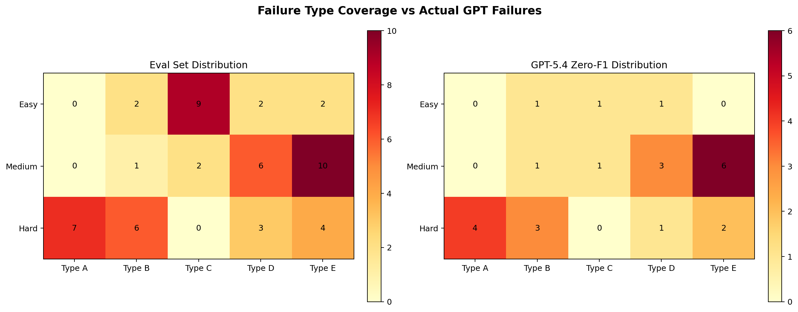

# 瓶颈诊断报告

任务：在真实 Celery 源码上识别跨文件依赖分析的低分共性瓶颈，并给出数据支撑的失效模式结论。  
源码版本：`external/celery @ b8f85213f45c937670a6a6806ce55326a0eb537f`

## 1. 评测集设计

### 1.1 基本信息

| 项目 | 值 |
|------|------|
| 正式评测集 | `data/eval_cases.json` |
| 样本数 | `54` |
| Difficulty | `easy 15 / medium 19 / hard 20` |
| 评分口径 | FQN 精确匹配，统一到 `direct / indirect / implicit` 三层 |

### 1.2 失效类型覆盖

| Failure Type | 含义 | 样本数 |
|------|------|------:|
| Type A | 长上下文 / 生命周期链路 | 7 |
| Type B | 隐式依赖 / 装饰器 / finalize | 9 |
| Type C | 再导出链 / 懒加载符号 | 11 |
| Type D | 命名空间 / 同名符号 / 作用域 | 11 |
| Type E | 动态加载 / 字符串引用 / symbol_by_name | 16 |

### 1.3 标注说明

`failure_type` 的来源分两类：

- `42` 条为人工直接标注，依据源码阅读、调用链追踪和模型错误样本逐条确认。
- `12` 条为规则推断，依据已定义的失效特征从 `category` / `difficulty` 映射得到，并在分析时单独保留为可审计来源。

因此，后续所有失效类型统计都应理解为“人工标注为主、规则推断补齐”的正式诊断口径，而不是把全部样本都当成纯人工标签。

## 2. 基线表现

| 模型 | Easy | Medium | Hard | Avg |
|------|------:|------:|------:|------:|
| GPT-5.4 | 0.4348 | 0.2188 | 0.2261 | 0.2815 |
| GLM-5 | 0.1048 | 0.0681 | 0.0367 | 0.0666 |
| Qwen3.5-9B | 0.0667 | 0.0526 | 0.0000 | 0.0370 |

### 2.1 直接观察

- GPT-5.4 仍然是最强基线，但平均 F1 只有 `0.2815`，远低于“可直接用”的水平。
- GLM-5 与 Qwen baseline 都明显不足，说明这个任务本身对“结构化依赖追踪”要求很高。
- GPT-5.4 在 `Hard` 上只有 `0.2261`，说明真正的难点并不在简单符号映射，而在长链路、动态加载和运行时修补。

## 3. 哪些失效最严重

### 3.1 GPT-5.4 按失效类型平均 F1

| Failure Type | Cases | Avg F1 | F1=0 数量 |
|------|------:|------:|------:|
| Type C | 11 | 0.5364 | 2 |
| Type D | 11 | 0.2904 | 5 |
| Type E | 16 | 0.2297 | 8 |
| Type B | 9 | 0.1669 | 5 |
| Type A | 7 | 0.1329 | 4 |

### 3.2 结论

这里有两个不同维度的“最难”：

1. **覆盖面最广的瓶颈是 Type E**  
   它有 `16` 个样本、`8` 个零分 case，是当前最主要的失败来源。模型经常知道相关文件，却不知道最终应该落到哪个真实 FQN。

2. **单 case 难度最大的瓶颈是 Type A / Type B**  
   Type A 平均 F1 最低，仅 `0.1329`；Type B 为 `0.1669`。这两类问题的共同点是需要理解生命周期、信号、装饰器或 finalize 流程，单靠表面文本相似度很难猜对。

## 4. GPT-5.4 零分分布

GPT-5.4 一共有 `24` 个 `F1=0` 的 case。

| Failure Type | Zero Count | 占零分比例 |
|------|------:|------:|
| Type E | 8 | 33.3% |
| Type D | 5 | 20.8% |
| Type B | 5 | 20.8% |
| Type A | 4 | 16.7% |
| Type C | 2 | 8.3% |



### 4.1 难度 × 失效类型的零分热点

| Difficulty | Type A | Type B | Type C | Type D | Type E |
|------|------:|------:|------:|------:|------:|
| easy | 0 | 1 | 1 | 1 | 0 |
| medium | 0 | 1 | 1 | 3 | 6 |
| hard | 4 | 3 | 0 | 1 | 2 |

### 4.2 诊断结论

- `medium + Type E` 是最密集的零分区域，说明动态字符串解析和 alias 链对中等复杂度问题已经足够致命。
- `hard + Type A` 零分最高，说明 bootstep / scheduler / lifecycle 类问题超出了纯语言模型的稳定推理范围。
- `Type C` 反而不是最大瓶颈，说明 GPT-5.4 对简单的再导出链已经有较强先验。

## 5. 三个代表性 Bad Case

### Case 1：`medium_007`，Type E，动态 alias 链只会报文件名不会报最终类

**问题**  
当线程中没有 current app 且未设置 `CELERY_LOADER` 时，首次访问 `celery.current_app.loader` 最终会实例化哪个 Loader 类？

**GPT-5.4 输出**

```json
{
  "direct_deps": [
    "celery/_state.py",
    "celery/app/base.py",
    "celery/loaders/__init__.py",
    "celery/loaders/default.py"
  ],
  "indirect_deps": ["os"],
  "implicit_deps": [
    "环境变量 CELERY_LOADER 未设置",
    "线程局部 current_app 为空时会回退到 default_app"
  ]
}
```

**正确答案**

```json
{
  "direct_deps": ["celery.loaders.default.Loader"],
  "indirect_deps": [
    "celery._state._get_current_app",
    "celery.app.base.Celery.loader",
    "celery.loaders.get_loader_cls"
  ],
  "implicit_deps": [
    "celery.local.Proxy",
    "celery.loaders.LOADER_ALIASES",
    "celery.utils.imports.symbol_by_name"
  ]
}
```

**归因**  
模型知道相关文件，但不会把字符串 alias 和 `symbol_by_name` 的动态解析真正落到最终实例化类上。这是最典型的 Type E。

### Case 2：`hard_003`，Type B，finalize 回调链路错把注册函数当成执行函数

**问题**  
哪个函数负责真正触发所有 shared-task 和 built-in finalize callbacks？

**GPT-5.4 输出**

```json
{
  "direct_deps": ["connect_on_app_finalize"],
  "indirect_deps": [],
  "implicit_deps": []
}
```

**正确答案**

```json
{
  "direct_deps": ["celery._state._announce_app_finalized"],
  "indirect_deps": [],
  "implicit_deps": []
}
```

**归因**  
模型把“注册 receiver 的函数”错认成“真正执行 receiver 的函数”。这类错误本质上不是找不到代码，而是对 callback 生命周期的角色分工理解错误。

### Case 3：`celery_hard_018`，Type E，Django fixup 条件下无法解析运行时改写后的 Task 基类

**问题**  
在满足 Django fixup 前置条件且未自定义 `task_cls` 时，`app.Task` 的最终基类解析到哪个真实类？

**GPT-5.4 输出**

```json
{
  "direct_deps": [
    "celery/fixups/django.py",
    "celery/app/base.py"
  ],
  "indirect_deps": ["celery/app/task.py"],
  "implicit_deps": [
    "DJANGO_SETTINGS_MODULE environment variable",
    "django package importability"
  ]
}
```

**正确答案**

```json
{
  "direct_deps": ["celery.contrib.django.task.DjangoTask"],
  "indirect_deps": [
    "celery.fixups.django.fixup",
    "celery.fixups.django.DjangoFixup.install",
    "celery.app.base.Celery.Task"
  ],
  "implicit_deps": ["celery.utils.imports.symbol_by_name"]
}
```

**归因**  
这是“条件成立后修改字符串类路径，再在运行时解析为真实类”的复合型动态场景，GPT-5.4 只能定位相关模块，无法完成最终归约。

## 6. 瓶颈结论

### 6.1 共性结论

1. **Type E 是最主要、最稳定的失败来源**  
   问题不是“完全不知道去哪里找”，而是“无法把动态字符串 / alias / proxy 最终收敛成真实 FQN”。

2. **Type A / Type B 是最难被纯推理模型硬解的场景**  
   这些场景需要对调用时序、生命周期、注册与执行关系有结构化理解。

3. **Type C 已经不是主要矛盾**  
   GPT-5.4 在再导出链上平均 F1 达到 `0.5364`，说明它对简单 re-export 追踪已有较强能力。

### 6.2 对后续优化策略的启发

| 瓶颈 | 最适合的优化方向 |
|------|------|
| Type E | RAG + Few-shot + 后处理 |
| Type B | FT + PE |
| Type A | RAG（结构召回）+ FT（模式固化） |
| Type C | PE 足够，大多不需要重型策略 |
| Type D | PE + RAG，必要时补 few-shot |

### 6.3 最终判断

当前任务的核心难点不是“代码太长”，而是：

- **动态字符串解析**
- **运行时别名 / fixup 改写**
- **回调与 finalize 链路**
- **生命周期阶段性的调用顺序**

这也是为什么项目最终必须走到 `PE / RAG / FT` 的组合，而不能只靠单一手段。
