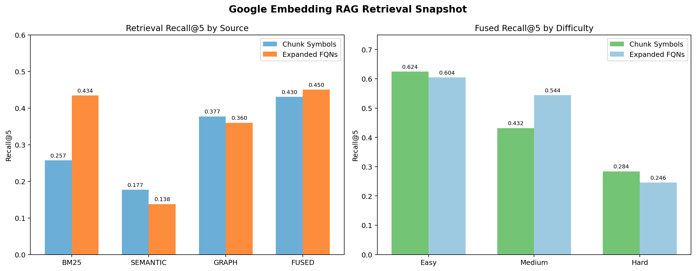
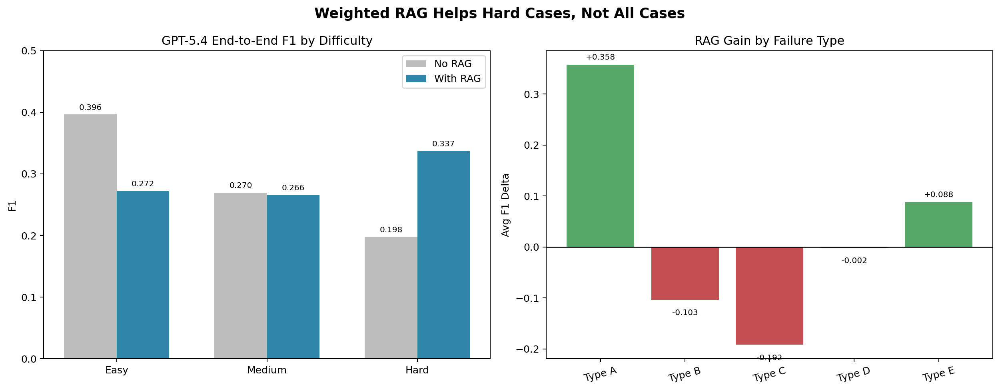

# RAG 增强管线报告

任务：面向 Celery 跨文件依赖分析，构建代码切片、混合检索、上下文拼接与生成融合的一体化 RAG Pipeline，并量化检索指标与端到端收益。

## 1. 管线概览

### 1.1 设计目标

要解决的不是普通语义问答，而是：

- 从入口符号追到真实定义
- 处理跨文件 import / re-export
- 处理字符串 alias 与 `symbol_by_name`
- 在有限上下文窗口里保留最关键的结构信号

### 1.2 当前管线

```text
Celery 源码
-> AST chunker
-> 3 路索引(BM25 / Semantic / Graph)
-> RRF 融合
-> question_plus_entry（54/54 条样本含 source_file，5/54 条样本另有显式 entry_symbol）构造查询
-> Top-K context build
-> 送入生成模型
-> JSON/FQN 输出
```

### 1.3 对应实现

- Chunking：[`../rag/ast_chunker.py`](../rag/ast_chunker.py)
- Embedding provider：[`../rag/embedding_provider.py`](../rag/embedding_provider.py)
- 混合检索：[`../rag/rrf_retriever.py`](../rag/rrf_retriever.py)
- 预计算脚本：[`../scripts/precompute_embeddings.py`](../scripts/precompute_embeddings.py)

## 2. 当前正式配置

| 项目 | 值 |
|------|------|
| 源码版本 | `external/celery @ b8f8521` |
| Chunk 数量 | `8086` |
| Embedding Provider | `google / gemini-embedding-001` |
| Query mode | `question_plus_entry` |
| Top-K | `5` |
| Per-source depth | `12` |
| RRF k | `30` |

### 2.1 关于 embedding cache

当前完整缓存文件：

- `artifacts/rag/embeddings_cache_google_gemini_embedding_001_3072.json`

说明：

- 当前机器上可以直接复用，不需要重新 embedding
- 该文件没有进入 git，因此换机器拉仓库后不会自动带下来
- 但仓库已经提供 `scripts/precompute_embeddings.py`，可在新机器上按同一配置重新生成正式 cache

## 3. 检索效果

### 3.1 总体指标

| View | Recall@5 | MRR |
|------|------:|------:|
| fused chunk_symbols | 0.4305 | 0.5292 |
| fused expanded_fqns | 0.4502 | 0.5596 |



### 3.2 单路对比

| Source | Chunk Recall@5 | Chunk MRR | Expanded Recall@5 | Expanded MRR |
|------|------:|------:|------:|------:|
| bm25 | 0.2569 | 0.3827 | 0.4345 | 0.5321 |
| semantic | 0.1767 | 0.1714 | 0.1377 | 0.2141 |
| graph | 0.3772 | 0.4522 | 0.3596 | 0.4782 |
| fused | 0.4305 | 0.5292 | 0.4502 | 0.5596 |

### 3.3 结论

1. **Graph 仍然是最强单路信号**  
   尤其在 chunk 级别，`graph Recall@5 = 0.3772`，说明引用关系和 import 关系对这个任务非常关键。

2. **最新 Google embedding 让 fused 真正超过了单路**  
   这和旧 50-case 报告中“graph 单路优于 fusion”的结论不同。当前正式结果下，`fused` 已经是最优选。

3. **BM25 不是废的，它在 expanded FQN 上仍很强**  
   `bm25 expanded Recall@5 = 0.4345`，说明关键词命中对模块路径与类名仍然有效。

4. **Semantic 单路最弱，但作为融合补充仍有价值**  
   单独看最差，但在 RRF 里能补掉部分“词不完全重合但语义接近”的 case。

## 4. 分难度表现

### 4.1 Fused expanded FQN

| Difficulty | Recall@5 | MRR |
|------|------:|------:|
| easy | 0.6044 | 0.5009 |
| medium | 0.5439 | 0.7553 |
| hard | 0.2456 | 0.4177 |

### 4.2 解读

- `hard` 仍然明显更难，说明“检索出相关片段”并不等于“已经抓到最终解析终点”。
- `medium` 表现很好，说明 question + entry 信息能够显著帮助 alias / re-export 场景。

## 5. 端到端 RAG 收益

### 5.1 GPT-5.4 端到端评测

| 指标 | No-RAG | With-RAG | Delta |
|------|------:|------:|------:|
| Overall Avg F1 | 0.2783 | 0.2940 | +0.0157 |
| easy | 0.3963 | 0.2722 | -0.1241 |
| medium | 0.2696 | 0.2656 | -0.0040 |
| hard | 0.1980 | 0.3372 | +0.1392 |



### 5.2 按失效类型的增益

| Failure Type | Delta |
|------|------:|
| Type A | +0.3578 |
| Type B | -0.1035 |
| Type C | -0.1919 |
| Type D | -0.0018 |
| Type E | +0.0877 |

### 5.3 结论

1. **RAG 明显帮助 Type A / Type E**  
   这两类问题都需要模型“看到更多结构上下文”。

2. **RAG 不能替代 FT 解决 Type B**  
   Type B 的核心是隐式依赖与幻觉，检索给再多上下文也可能继续误解调用关系。

3. **RAG 对 Type C 甚至可能是负收益**  
   对很多 re-export 问题，模型本来直接就能答对，额外上下文反而可能把它引到中间跳板上。

## 6. 当前工程结论

### 6.1 如果只看检索层

当前 RAG Pipeline 已经是“正式可用版本”，原因是：

- Google embedding 已完成
- 最新 `fused` 指标优于单路
- 检索层不再处于“需要换方案”的状态

### 6.2 如果看生成层

RAG 不能默认全开，正确用法是：

- `hard / Type A / Type E`：优先启用
- `easy / 部分 Type C`：可考虑只用 PE

### 6.3 当前最稳的结论

RAG 在这个项目里不是“平均分提升器”，而是“复杂场景修复器”。  
检索层已经收口，下一步重点不是继续换 embedding，而是围绕 hard / Type A / Type E 做更细粒度的条件式触发和上下文降噪。
